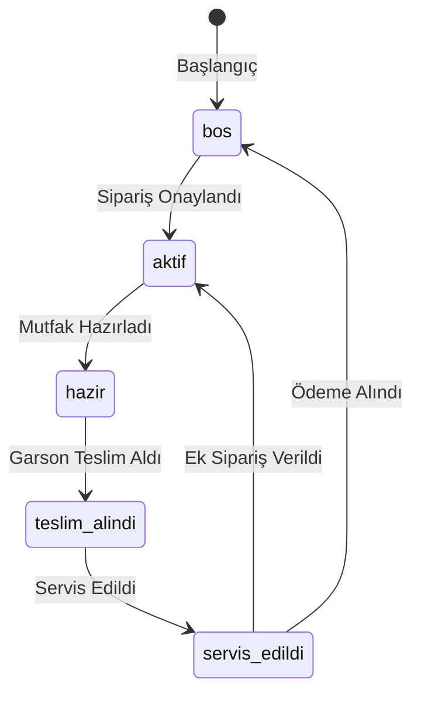

# Adisyon Uygulaması - Gereksinim Dokümanı (PRD) FLUTTER İLE GERÇEK ZAMANLI MÜKEMMEL YENİ NESİL TASARIM VE ui ve effektif geçişler mükemmel arayüz herşey yeni nesil olmalı

## Genel Bakış
Supabase tabanlı gerçek zamanlı adisyon uygulaması için kapsamlı gereksinim dokümanı. Uygulama 4 ana panel içerecek:
1. **Garson Paneli**
2. **Mutfak Paneli**
3. **Kasiyer Paneli**
4. **Yönetici Paneli** (Ürün Yönetimi ve Raporlama)

---

## Teknik Özellikler
MCP SUPABASE ÇAĞIRABİLİRSİN
- **Backend**: Supabase (PostgreSQL + Realtime)
- **Kimlik Doğrulama**: Rol bazlı giriş (şifre ile)
- **Gerçek Zamanlı İletişim**: Supabase Realtime özellikleri
- **Veritabanı**: Yüksek performanslı PostgreSQL yapılandırması

---

## Veritabanı Şeması

### 1. Tablolar - YAPILDI

```sql
-- Kullanıcılar Tablosu
CREATE TABLE kullanicilar (
  id UUID DEFAULT gen_random_uuid() PRIMARY KEY,
  rol TEXT NOT NULL CHECK (rol IN ('garson', 'mutfak', 'kasiyer', 'yonetici')),
  sifre TEXT NOT NULL
);

-- Masalar Tablosu
CREATE TABLE masalar (
  id SMALLINT PRIMARY KEY CHECK (id BETWEEN 1 AND 100),
  durum TEXT NOT NULL DEFAULT 'bos' 
    CHECK (durum IN ('bos', 'aktif', 'hazir', 'teslim_alindi', 'servis_edildi')),
  son_guncelleme TIMESTAMP WITH TIME ZONE DEFAULT CURRENT_TIMESTAMP
);

-- Ürünler Tablosu
CREATE TABLE urunler (
  id SERIAL PRIMARY KEY,
  ad TEXT NOT NULL UNIQUE,
  fiyat NUMERIC(10,2) NOT NULL,
  kategori TEXT NOT NULL
);

-- Siparişler Tablosu
CREATE TABLE siparisler (
  id UUID DEFAULT gen_random_uuid() PRIMARY KEY,
  masa_id SMALLINT REFERENCES masalar(id) ON DELETE CASCADE,
  urunler JSONB NOT NULL, -- {urun_id: miktar} formatında
  notlar TEXT,
  durum TEXT NOT NULL DEFAULT 'bekliyor' 
    CHECK (durum IN ('bekliyor', 'hazirlaniyor', 'hazir', 'teslim_edildi')),
  olusturulma_zamani TIMESTAMP WITH TIME ZONE DEFAULT CURRENT_TIMESTAMP,
  guncellenme_zamani TIMESTAMP WITH TIME ZONE DEFAULT CURRENT_TIMESTAMP
);

-- Ödemeler Tablosu
CREATE TABLE odemeler (
  id UUID DEFAULT gen_random_uuid() PRIMARY KEY,
  masa_id SMALLINT REFERENCES masalar(id) ON DELETE CASCADE,
  toplam_tutar NUMERIC(10,2) NOT NULL,
  odeme_tipi TEXT NOT NULL CHECK (odeme_tipi IN ('nakit', 'kredi_karti')),
  alinan_tutar NUMERIC(10,2),
  para_ustu NUMERIC(10,2) GENERATED ALWAYS AS (alinan_tutar - toplam_tutar) STORED,
  odeme_zamani TIMESTAMP WITH TIME ZONE DEFAULT CURRENT_TIMESTAMP
);
```

### 2. Tetikleyiciler - YAPILDI

```sql
-- Masa durumu değişikliklerinde zaman damgası güncelleme
CREATE OR REPLACE FUNCTION masa_durum_guncelle()
RETURNS TRIGGER AS $$
BEGIN
  NEW.son_guncelleme = CURRENT_TIMESTAMP;
  RETURN NEW;
END;
$$ LANGUAGE plpgsql;

CREATE TRIGGER masa_durum_trigger
BEFORE UPDATE ON masalar
FOR EACH ROW
WHEN (OLD.durum IS DISTINCT FROM NEW.durum)
EXECUTE FUNCTION masa_durum_guncelle();

-- Sipariş durum değişikliklerinde zaman damgası güncelleme
CREATE OR REPLACE FUNCTION siparis_durum_guncelle()
RETURNS TRIGGER AS $$
BEGIN
  NEW.guncellenme_zamani = CURRENT_TIMESTAMP;
  RETURN NEW;
END;
$$ LANGUAGE plpgsql;

CREATE TRIGGER siparis_durum_trigger
BEFORE UPDATE ON siparisler
FOR EACH ROW
WHEN (OLD.durum IS DISTINCT FROM NEW.durum)
EXECUTE FUNCTION siparis_durum_guncelle();
```

### 3. View'lar - YAPILDI

```sql
-- Aktif Siparişler View'ı
CREATE VIEW aktif_siparisler AS
SELECT s.*, m.id AS masa_no
FROM siparisler s
JOIN masalar m ON s.masa_id = m.id
WHERE s.durum IN ('bekliyor', 'hazirlaniyor');

-- Ödeme Bekleyen Masalar View'ı
CREATE VIEW odeme_bekleyen_masalar AS
SELECT m.id AS masa_no, 
       SUM(u.fiyat * (s.urunler->>(u.id::TEXT)::INT) AS toplam_tutar
FROM masalar m
JOIN siparisler s ON m.id = s.masa_id
JOIN urunler u ON s.urunler ? u.id::TEXT
WHERE m.durum = 'servis_edildi'
GROUP BY m.id;
```

---

## Rol Bazlı Kimlik Doğrulama - YAPILDI

| Rol      | Kullanıcı Adı | Şifre       | Erişim Paneli                   |
|----------|---------------|-------------|--------------------------------|
| Garson   | garson        | garson123   | Garson Paneli                  |
| Mutfak   | mutfak        | mutfak123   | Mutfak Paneli                  |
| Kasiyer  | kasiyer       | kasiyer123  | Kasiyer Paneli                 |
| Yönetici | yonetici      | yonetici123 | Ürün Yönetimi, Raporlama Paneli |

---

## İş Akışı ve Durum Yönetimi

### Masa Durum Döngüsü:


### Renk Kodları:
- **Boş**: Gri (#CCCCCC)
- **Aktif**: Mavi (#2196F3) + "AKTİF" yazısı
- **Hazır**: Yeşil (#4CAF50) + "HAZIR" yazısı
- **Teslim Alındı**: Turuncu (#FF9800) + "TESLİM ALINDI" yazısı
- **Servis Edildi**: Mor (#9C27B0) + "SERVİS EDİLDİ" yazısı

---

## Panel Detayları

### 1. Garson Paneli
- **100 masa** grid görünümü (5x5)
- Masalar durumlarına göre renklendirilmiş
- Masa tıklama işlemleri:
  1. Ürün ekleme (çoklu seçim)
  2. Özel not ekleme
  3. "Siparişi Onayla" butonu
- Sipariş onaylandığında:
  - Masa durumu "aktif" (mavi)
  - Sipariş mutfağa gerçek zamanlı iletilecek
- "Hazır" durumundaki masaları görüntüleme
  - "Teslim Aldım" butonu (durum: teslim_alindi)
- "Teslim Alındı" durumundaki masalar:
  - "Servis Edildi" butonu (durum: servis_edildi)

### 2. Mutfak Paneli
- Sadece "aktif" durumdaki siparişler listelenir
- Sipariş detayları:
  - Masa No
  - Ürün listesi
  - Notlar
  - Zaman damgası
- "Hazırlandı" butonu:
  - Sipariş durumu "hazır" olarak güncellenir
  - İlgili masa durumu "hazır" (yeşil) olur

### 3. Kasiyer Paneli
- "Servis Edildi" durumundaki masalar listelenir
- Masa seçimi:
  - Tüm siparişlerin toplam tutarı gösterilir
  - Ödeme tipi seçimi (nakit/kredi kartı)
  - Nakit için:
    - Alınan tutar girişi
    - Otomatik para üstü hesaplama
  - "Ödemeyi Tamamla" butonu:
    - Ödeme kaydı oluşturulur
    - Masa durumu "boş" olarak güncellenir
    - İlgili siparişler arşivlenir

### 4. Yönetici Paneli - Ürün Yönetimi
- **CRUD Arayüzü**: Yöneticinin ürünleri tam olarak yönetmesini sağlar.
- **Ürün Listesi**: Tüm ürünler, ad, kategori ve fiyat bilgileriyle listelenir.
- **Yeni Ürün Ekleme**:
  - Form aracılığıyla yeni ürün adı, fiyatı ve kategorisi girilir.
  - Veritabanına yeni kayıt eklenir.
- **Ürün Düzenleme**:
  - Mevcut bir ürünün bilgileri (ad, fiyat, kategori) güncellenir.
- **Ürün Silme**:
  - Seçilen bir ürün, onay alındıktan sonra veritabanından silinir.

### 5. Yönetici Paneli - Raporlama
- **İş Zekası**: Satış verilerini analiz ederek işletme hakkında değerli bilgiler sunar.
- **Tarih Aralığı Seçimi**: Raporların oluşturulacağı başlangıç ve bitiş tarihi seçilir.
- **Genel Raporlar**:
  - **Toplam Ciro**: Seçilen aralıktaki toplam kazanç.
  - **Toplam Sipariş Sayısı**: Belirtilen aralıktaki toplam sipariş adedi.
- **En Çok Satan Ürünler**:
  - Seçilen tarih aralığında en çok sipariş edilen ürünler, satış adetleriyle birlikte listelenir.
- **Grafikler**:
  - Satışların günlere veya saatlere göre dağılımını gösteren bir çubuk veya çizgi grafik.

---

## İş Mantığı (RPC Fonksiyonları) - YAPILDI
Backend, iş akışlarını güvenli ve atomik bir şekilde yönetmek için veritabanı fonksiyonlarını (RPC) kullanır. Bu, istemci (Flutter) tarafındaki kodun basit kalmasını sağlar ve iş mantığının ihlal edilmesini önler.
- `siparisi_onayla(masa_id, urunler, notlar)`: Garsonun yeni sipariş oluşturmasını ve masa durumunu güncellemesini sağlar.
- `siparisi_hazir_yap(siparis_id)`: Mutfağın bir siparişi ve ilgili masayı "hazır" olarak işaretlemesini sağlar.
- `siparisi_teslim_alindi(siparis_id)`: Garsonun siparişi teslim almasını ve masa durumunu güncellemesini sağlar.
- `servis_edildi(masa_id)`: Garsonun servisi tamamlamasını ve masayı ödemeye hazır hale getirmesini sağlar.
- `odemeyi_tamamla(masa_id, odeme_tipi, alinan_tutar)`: Kasiyerin ödemeyi tamamlamasını ve masayı boşaltmasını sağlar.

### Raporlama RPC Fonksiyonları (Yönetici)
- `get_ciro_raporu(baslangic_tarihi, bitis_tarihi)`: Belirtilen tarih aralığındaki toplam ciro ve sipariş sayısı gibi temel metrikleri döndürür.
- `get_en_cok_satan_urunler(baslangic_tarihi, bitis_tarihi, limit)`: Belirtilen aralıkta en çok satan ürünleri miktarlarıyla birlikte döndürür.

---

## Gerçek Zamanlı İşlemler - YAPILDI
- Tüm durum değişiklikleri Supabase Realtime ile anlık iletilir. `masalar` ve `siparisler` tabloları için gerçek zamanlı yayın (publication) etkinleştirilmiştir.
- Abonelikler:
  ```javascript
  // Masa durum değişiklikleri
  const masalarAbonelik = supabase
    .from('masalar')
    .on('UPDATE', payload => {
      // Masa arayüzünü güncelle
    })
    .subscribe();

  // Yeni siparişler (mutfak için)
  const siparisAbonelik = supabase
    .from('siparisler')
    .on('INSERT', payload => {
      if(payload.new.durum === 'bekliyor') {
        // Mutfak paneline ekle
      }
    })
    .subscribe();
  ```

---

## Güvenlik ve Performans - YAPILDI
1. **Row Level Security (RLS)**: Tüm tablolarda etkin. Her rolün (garson, mutfak, kasiyer) sadece yetkili olduğu verileri görmesini ve değiştirmesini sağlayan politikalar tanımlanmıştır.
2. **Kimlik Doğrulama**:
   - Güvenli Supabase Auth sistemi kullanılmaktadır.
   - Rol bazlı izinler, kullanıcının JWT meta verileri üzerinden kontrol edilir.
3. **İndeksler**:
   ```sql
   CREATE INDEX idx_masalar_durum ON masalar(durum);
   -- Yüksek performanslı birleşik indeks ile optimize edildi
   CREATE INDEX idx_siparisler_masa_durum ON siparisler(masa_id, durum);
   ```
4. **Performans Optimizasyonu**:
   - Sık erişilen tablolar için partial indeksler
   - Sık güncellenen tablolar için tablo bölümleme
   - Sorgu optimizasyonu (EXPLAIN ANALYZE)

---

## Hata Senaryoları ve Çözümler
1. **Çakışan Siparişler**:
   - Optimistic Locking uygulanacak
   - Sipariş onayında masa durum kontrolü
   
2. **Veri Kaybı**:
   - Transaction blokları tüm kritik işlemlerde
   - Otomatik yedekleme (Supabase Backup)

3. **Bağlantı Sorunları**:
   - Offline First yaklaşımı
   - Yerel önbellekleme (localForage)
   - Yeniden bağlantı senkronizasyonu

---

## Kurulum ve Dağıtım
1. **Gereksinimler**:
   - Node.js v18+
   - Supabase hesabı

2. **Kurulum Adımları**:
   ```bash
   # Proje klonlama
   git clone https://github.com/adisyon-uygulamasi.git
   cd adisyon-uygulamasi
   
   # Bağımlılıklar
   npm install
   
   # Çevre değişkenleri
   cp .env.example .env
   
   # Başlatma
   npm run dev
   ```

3. **Supabase Kurulumu**:
   - `supabase init`
   - Şema yükleme: `supabase db push`
   - RLS politikalarının ayarlanması

---

## Test Senaryoları
1. **Garson Akışı**:
   - Masa seçimi → Ürün ekleme → Not ekleme → Sipariş onaylama → Durum değişimi kontrolü

2. **Mutfak Akışı**:
   - Sipariş görüntüleme → Hazırlandı işaretleme → Durum değişimi kontrolü

3. **Kasiyer Akışı**:
   - Ödeme bekleyen masalar → Ödeme alma → Para üstü hesaplama → Masa boşaltma

4. **Ek Sipariş Senaryosu**:
   - Servis edilmiş masa → Yeni sipariş → Sadece yeni ürünlerin mutfağa gitmesi

---

## Kapanış
Bu doküman, Supabase tabanlı gerçek zamanlı adisyon sisteminin tüm teknik ve işlevsel gereksinimlerini kapsamaktadır. Sistemin sağlamlığı için;
- Sıkı veri bütünlüğü kontrolleri
- Gerçek zamanlı senkronizasyon
- Rol bazlı erişim kontrolü
- Kapsamlı hata yönetimi

öncelikli olarak uygulanacaktır. Proje geliştirme süreci Agile metodolojisi ile yürütülecek ve her iterasyonda testler tekrarlanacaktır.